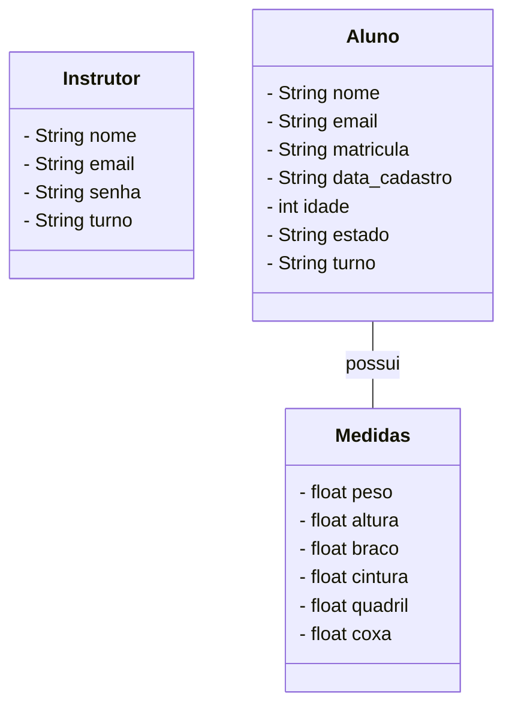

# Academia-Caju-Fitness 

Projeto de API Rest representando uma academia escolar fictícia.

# Diagrama de Classes

```mermaid
classDiagram
  class Instrutor {
    - String nome
    - String email
    - String senha
    - String turno
  }
  class Aluno {
    - String nome
    - String email
    - String matricula
    - String data_cadastro
    - int idade
    - String estado
    - String turno
  }
  class Medidas {
    - float peso
    - float altura
    - float braco
    - float cintura
    - float quadril
    - float coxa
  }
  
  Aluno -- Medidas : possui
```
